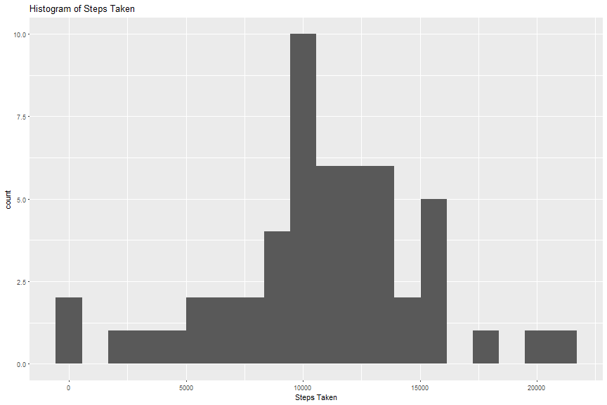
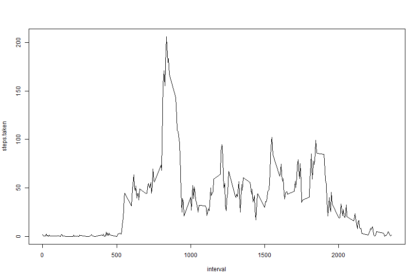
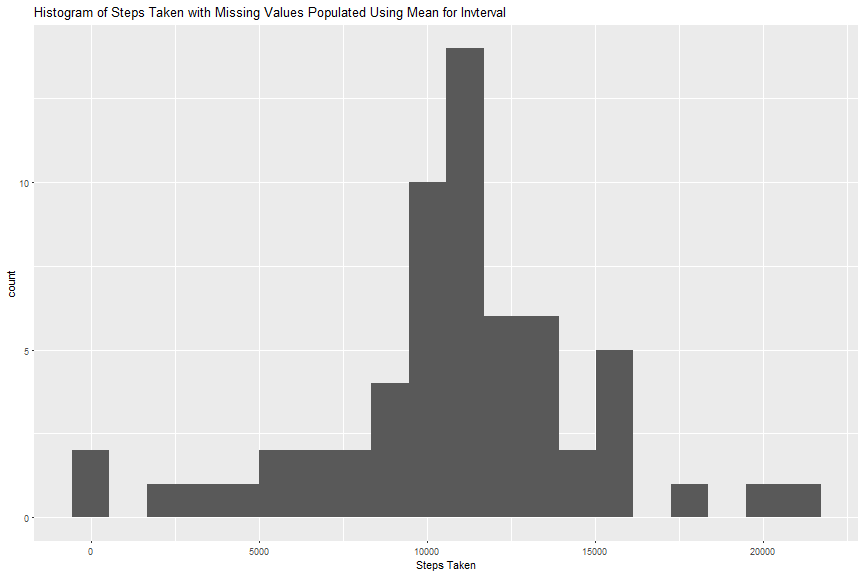
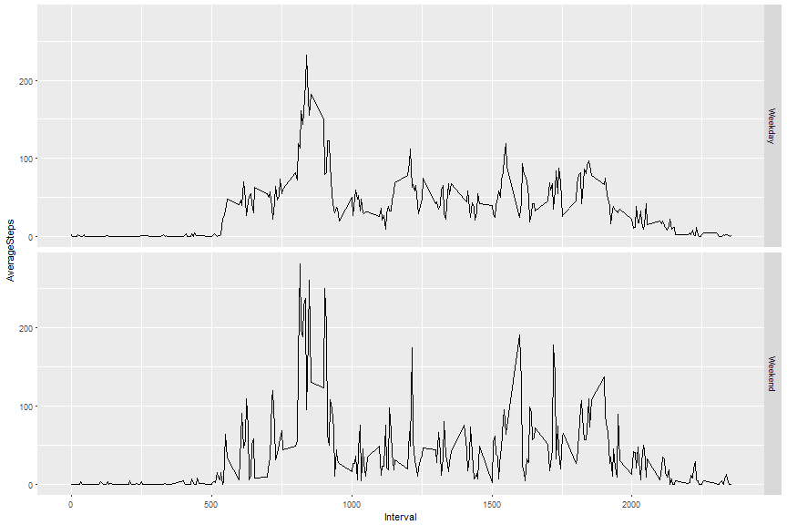

Set global options


## Loading and preprocessing the data

This assumes the activity.zip is downloaded and extracted to the current working directory

1. Load the file
2. Create a new variable to store the daily total of steps


```r
library(dplyr)
library(ggplot2)
library(lubridate)
activity <- read.csv("activity.csv",header=TRUE)
```


## What is mean total number of steps taken per day?

1. Calculate the total number of steps taken per day

```r
steps.daily.sum <- summarise( group_by( activity, date), sum(steps))
```

2.  Make a histogram of the total number of steps taken each day

```r
ggplot(data=steps.daily.sum, aes(x=steps.daily.sum$`sum(steps)`)) +
      geom_histogram(bins = 20) +
      labs(x="Steps Taken", title="Histogram of Steps Taken")
```



3.  Calculate and report the mean and median of the total number of steps taken per day

```r
steps.daily.mean <- mean(steps.daily.sum$`sum(steps)`,na.rm = TRUE)
steps.daily.median <- median(steps.daily.sum$`sum(steps)`,na.rm = TRUE)
```
The mean number of steps taken is 1.0766189 &times; 10<sup>4</sup>.
The median number of steps taken is 10765.

## What is the average daily activity pattern?

1.  Make a time series plot (i.e. type = "l") of the 5-minute interval (x-axis) and the average number of steps taken, averaged across all days (y-axis)

```r
steps.by.interval <- summarise( group_by( activity, interval), mean(steps,na.rm = TRUE))
colnames(steps.by.interval) = c("interval", "steps.taken")
plot(steps.taken~interval,data=steps.by.interval,type="l")
```



2.  Which 5-minute interval, on average across all the days in the dataset, contains the maximum number of steps?

```r
interval.max.steps <- steps.by.interval$interval[which.max(steps.by.interval$steps.taken)]
```
The interval with the most steps (on average) is 835

## Imputing missing values

1. Calculate and report the total number of missing values in the dataset (i.e. the total number of rows with NAs)

```r
missing.values <- length(which(is.na(activity$steps)))
```
There are 2304 missing values in the data set

2. Devise a strategy for filling in all of the missing values in the dataset. 

The strategy is to set any NA values to the mean number of steps for that interval caluclated above in steps.by.interval

* activity.imputed will be created by merging activity and the mean number of steps resulting in 4 columns, the last one containing the mean steps for that interval
* Any NA values in steps variable (original variable from activity) will then be replaced with the steps.taken value (from steps.by.interval)
* The fourth column which contains the steps.taken variable is then dropped from the data frame so the structure matches the original activity


3. Create a new dataset that is equal to the original dataset but with the missing data filled in.

```r
activity.imputed <- merge(activity,steps.by.interval,by="interval")
activity.imputed$steps[is.na(activity.imputed$steps)] <- activity.imputed$steps.taken[is.na(activity.imputed$steps)]
activity.imputed <- activity.imputed[,-4]
```


4. Make a histogram of the total number of steps taken each day and Calculate and report the mean and median total number of steps taken per day. Do these values differ from the estimates from the first part of the assignment? What is the impact of imputing missing data on the estimates of the total daily number of steps?


```r
steps.daily.sum.imputed <- summarise( group_by( activity.imputed, date), sum(steps))
ggplot(data=steps.daily.sum.imputed, aes(x=steps.daily.sum.imputed$`sum(steps)`)) +
      geom_histogram(bins = 20) +
      labs(x="Steps Taken", title="Histogram of Steps Taken with Missing Values Populated Using Mean for Invterval")
```




```r
steps.daily.mean.imputed <- mean(steps.daily.sum.imputed$`sum(steps)`,na.rm = TRUE)
steps.daily.median.imputed <- median(steps.daily.sum.imputed$`sum(steps)`,na.rm = TRUE)
```
The mean number of steps taken after filling in missing values is 1.0766189 &times; 10<sup>4</sup>.
The median number of steps taken after filling in missing values is 1.0766189 &times; 10<sup>4</sup>.

##  Are there differences in activity patterns between weekdays and weekends?

For this section a new variable (day.name) will be added to the imputed data set to determine if the date is a weekday or weekend.  The date field is a factor and will be converted to date for the 
weekdays() function to convert

```r
activity$day.type <-
      sapply(steps.daily.sum.imputed$date,
            function(x){
                  if(weekdays(as.Date(x)) %in% c("Monday","Tuesday","Wednesday","Thursday","Friday")) 
                     {as.factor("Weekday")} 
                  else 
                     {as.factor("Weekend")}
            }
      )

steps.weekday.interval <- summarise( group_by( activity,interval, day.type ),mean(steps,na.rm = TRUE))
names(steps.weekday.interval) <- c("Interval","Weekday.or.Weekend","AverageSteps")
```

Create two plots (weekend and weekday) showing steps in each interval

```r
ggplot(data=steps.weekday.interval, aes(x=Interval,y=AverageSteps)) + geom_line() + facet_grid(Weekday.or.Weekend~.)
```


